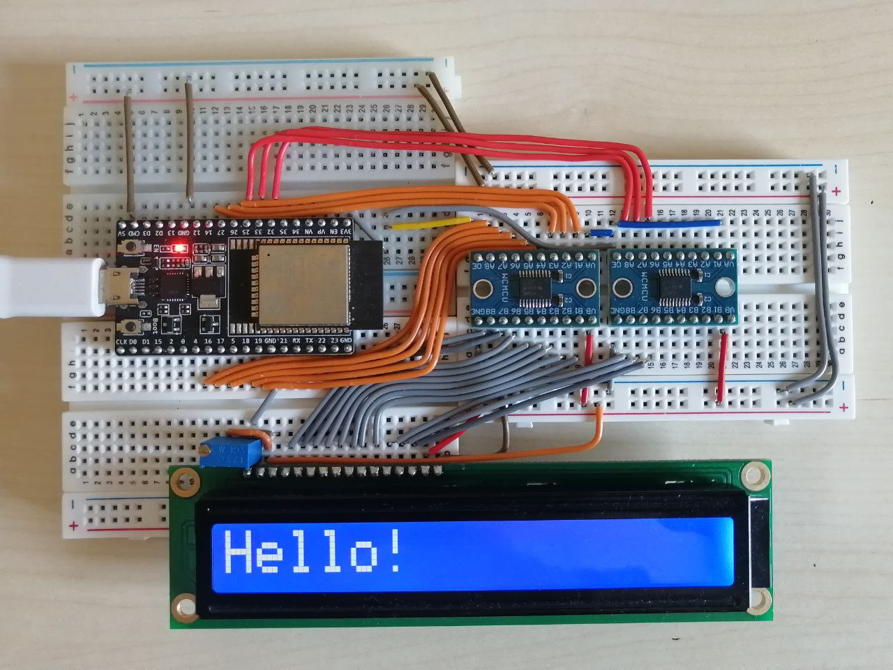
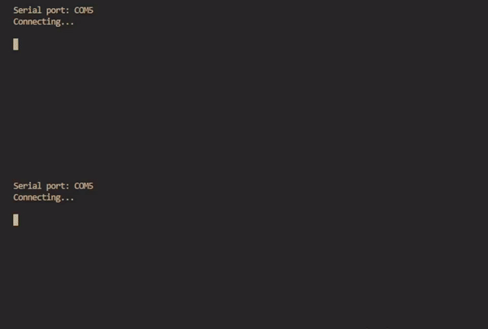
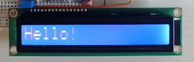
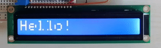
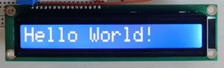
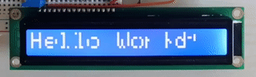

# LCD Experiments

This repo contains some experiments I'm doing with a Wiznet [WH1601L-TMI-JT#] LCD character display and an esp32 module.

[WH1601L-TMI-JT#]: https://download.unisystem.pl/mono-LCM/WH1601L-TMI-JT/WH1601L-TMI-JT.pdf

# Circuit

The following image shows the circuit I'm using containing:
- on the top left: the esp32 module
- on the bottom: the LCD
- on the top right: two level shifters (esp 3.3v → lcd 5v)

This was actually my first breadboard circuit that went beyond a couple of leds connected to an Arduino, and I think it turned out great.

TODO: add circuit diagram

## Why the 8bit bus?

I chose to use the an 8bit bus instead of the 4bit one just because I find it cooler

## Why the level shifters

The level shifters are needed for the read operations, and, I haven't tested it, but for write-only operations the specs indicate that it shouldn't without work anyway.

> Fun fact: *I actually didn't know that was a thing to consider and initially designed and built the circuit without them. Because of that I had to verify that none of the GPIOs I were using were broken, and, fortunately, none of them were.*

# Firmware

The firmware consist of a low-level LCD driver which I wrote following the specification of the driver used by the [WH1601L-TMI-JT#], which is the [ST7066].

[ST7066]: https://www.sparkfun.com/datasheets/LCD/st7066.pdf

At the start of this process I was using the [`esp-idf-hal`] create (I was following the [book](https://esp-rs.github.io/book/)) but at some point I realized that I didn't need a fully featured RTOS for this, and given the long compile and flash times, I decided to swich to the [`esp32-hal`].

[`esp-idf-hal`]: https://crates.io/crates/esp-idf-hal/
[`esp32-hal`]: https://crates.io/crates/esp32-hal/

Writing generic code with the `esp-idf-hal` was a lot nicer but the compilation and flashing times where significally improved.

Here is show the amount of time it took to flash a binary compiled with the IDF (top) vs with the HAL (bottom):

# Pixel-level Animations

This is the first thing I wanted to try when I got into this project, managing the screen at the pixel level.

This is possible thanks to the configurable characters present in the LCD controller, but, unfortunately, for the one I'm using those are only 8, which can only cover half of the characters shown on the screen.

This was the biggest challenge (which I ultimately failed) that came when implementing those kind of animations.

## Pixel-by-pixel Scroll

For testing this approach I decided to make a pixel-by-pixel scrolling message.

A problem that arised was how to handle the gap between each character on the display.
There are two ways to handle it:
- consider the column of pixel as being there but *not working/hidden*, or
- skip that column of pixels as if there was no gap

|**HIDE**|**SKIP**|
|:-:|:-:|
|||

TODO: try to reduce the flickering

This works somewhat well enough for text smaller then 7 characters.

> **Why 7 characters and not 8?**
>
> When the character is not centered it occupies two custom entries, so for the word “Hello!” (6 characters) during the scroll there are 7 custom characters:
> - `‘ ’` + `‘H’`
> - `‘H’` + `‘e’`
> - `‘e’` + `‘l’`
> - `‘l’` + `‘l’`
> - `‘l’` + `‘o’`
> - `‘o’` + `‘!’`
> - `‘!’` + `‘ ’`

When the word becomes longer the problem of the limited number of custom characters as to be handled in some way.
The first thing I tried was to approximate the bitmap by finding the closest one on the DDROM, which turned out to be looking a lot glitchy.

|**HIDE**|**SKIP**|
|:-:|:-:|
|||

This already started to take too long to render, and ultimately I don't think it can get better than this while still retaining a sub 10ms rendering time.

Some ideas include to improve the output:
- approximations caching
- approximate on the CGRAM
- merge similar characters on the CGRAM
- manual approximations with software rendering
